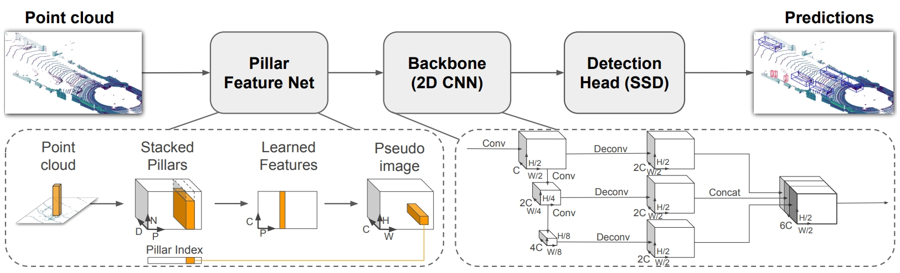

# Pointpillars from mmdet3d to NVIDIA XAVIER in python

This is an interesting and practical project.This project provides a complete pipeline for training, pruning, and deploying deep learning 3D point cloud detection models to xavier.

> [!NOTE]
>
> It has been a long time since we started this project, and readme needs some time to recall

### Description

**Pointpillars.py:** Independently separate pointpillars from mmdet3d

**Pointpillars_part.py:**  Some errors occured in pytorch2onnx. So divide the pointpillars into 2 parts, leading to a successful pth2onnx 

***_slim.py:** Based on the scale parameter γ, reduce the number of channels in each layers according to the set threshold for sliming the parameters, and record the channel indexes that needs to be retained. Then finetune the slimmed model

**onnx_tensorrt_infer.py:** onnx2tensorrt

> [!IMPORTANT]
>
> I think this project provides us with a simple but effective pipeline that transfers the edge model into the practical deployment. The pipeline is as followed:
>
> 1. Separate the object from the complex framework e.g. mmdet3d, mmpose
> 2. find the unsupported operations in infer framework (onnx, tensorrt, ncnn, etc)
> 3. transfer and replace the unsupported operations in the model
> 4. infer
